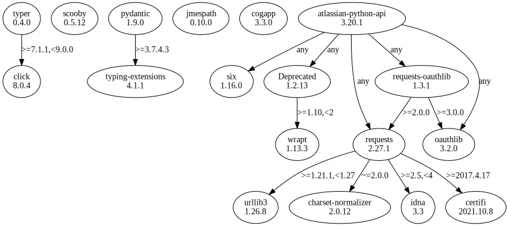

# Third Party Dependencies

<!--[[[fill sbom_sha256()]]]-->
The [SBOM in CycloneDX v1.4 JSON format](https://git.sr.ht/~sthagen/laskea/blob/default/etc/sbom/cdx.json) with SHA256 checksum ([a55ee831 ...](https://git.sr.ht/~sthagen/laskea/blob/default/etc/sbom/cdx.json.sha256 "sha256:a55ee8319d51375e86dbec2185b3b95157fb3b840e38ea17bc4ca3e2c015b7f9")).
<!--[[[end]]] (checksum: 56c91246817f84f8f254b649960d7a35)-->
## Licenses 

JSON files with complete license info of: [direct dependencies](direct-dependency-licenses.json) | [all dependencies](all-dependency-licenses.json)

### Direct Dependencies

<!--[[[fill direct_dependencies_table()]]]-->
| Name                                                                          | Version                                                         | License                            | Author                                                                                                                                                                                                                                                                                                                                                                                                                           | Description (from packaging data)                                       |
|:------------------------------------------------------------------------------|:----------------------------------------------------------------|:-----------------------------------|:---------------------------------------------------------------------------------------------------------------------------------------------------------------------------------------------------------------------------------------------------------------------------------------------------------------------------------------------------------------------------------------------------------------------------------|:------------------------------------------------------------------------|
| [atlassian-python-api](https://github.com/atlassian-api/atlassian-python-api) | [3.41.4](https://pypi.org/project/atlassian-python-api/3.41.4/) | Apache Software License            | Matt Harasymczuk                                                                                                                                                                                                                                                                                                                                                                                                                 | Python Atlassian REST API Wrapper                                       |
| [cogapp](http://nedbatchelder.com/code/cog)                                   | [3.3.0](https://pypi.org/project/cogapp/3.3.0/)                 | MIT License                        | Ned Batchelder                                                                                                                                                                                                                                                                                                                                                                                                                   | Cog: A content generator for executing Python snippets in source files. |
| [defusedxml](https://github.com/tiran/defusedxml)                             | [0.7.1](https://pypi.org/project/defusedxml/0.7.1/)             | Python Software Foundation License | Christian Heimes                                                                                                                                                                                                                                                                                                                                                                                                                 | XML bomb protection for Python stdlib modules                           |
| [jmespath](https://github.com/jmespath/jmespath.py)                           | [1.0.1](https://pypi.org/project/jmespath/1.0.1/)               | MIT License                        | James Saryerwinnie                                                                                                                                                                                                                                                                                                                                                                                                               | JSON Matching Expressions                                               |
| [openpyxl](https://openpyxl.readthedocs.io)                                   | [3.1.2](https://pypi.org/project/openpyxl/3.1.2/)               | MIT License                        | See AUTHORS                                                                                                                                                                                                                                                                                                                                                                                                                      | A Python library to read/write Excel 2010 xlsx/xlsm files               |
| [pydantic](https://github.com/pydantic/pydantic)                              | [2.5.2](https://pypi.org/project/pydantic/2.5.2/)               | MIT License                        | Samuel Colvin <s@muelcolvin.com>, Eric Jolibois <em.jolibois@gmail.com>, Hasan Ramezani <hasan.r67@gmail.com>, Adrian Garcia Badaracco <1755071+adriangb@users.noreply.github.com>, Terrence Dorsey <terry@pydantic.dev>, David Montague <david@pydantic.dev>, Serge Matveenko <lig@countzero.co>, Marcelo Trylesinski <marcelotryle@gmail.com>, Sydney Runkle <sydneymarierunkle@gmail.com>, David Hewitt <mail@davidhewitt.io> | Data validation using Python type hints                                 |
| [requests-cache](https://github.com/requests-cache/requests-cache)            | [1.1.1](https://pypi.org/project/requests-cache/1.1.1/)         | BSD License                        | Roman Haritonov                                                                                                                                                                                                                                                                                                                                                                                                                  | A persistent cache for python requests                                  |
| [scooby](https://github.com/banesullivan/scooby)                              | [0.9.2](https://pypi.org/project/scooby/0.9.2/)                 | MIT License                        | Dieter Werthmüller, Bane Sullivan, Alex Kaszynski, and contributors                                                                                                                                                                                                                                                                                                                                                              | A Great Dane turned Python environment detective                        |
| [typer](https://github.com/tiangolo/typer)                                    | [0.9.0](https://pypi.org/project/typer/0.9.0/)                  | MIT License                        | Sebastián Ramírez                                                                                                                                                                                                                                                                                                                                                                                                                | Typer, build great CLIs. Easy to code. Based on Python type hints.      |
<!--[[[end]]] (checksum: 6f8ac541bb65bc48ef2b1b3d29801f3a)-->

### Indirect Dependencies

<!--[[[fill indirect_dependencies_table()]]]-->
| Name                                                                                | Version                                                     | License                              | Author                                                                                | Description (from packaging data)                                                                       |
|:------------------------------------------------------------------------------------|:------------------------------------------------------------|:-------------------------------------|:--------------------------------------------------------------------------------------|:--------------------------------------------------------------------------------------------------------|
| [Deprecated](https://github.com/tantale/deprecated)                                 | [1.2.14](https://pypi.org/project/Deprecated/1.2.14/)       | MIT License                          | Laurent LAPORTE                                                                       | Python @deprecated decorator to deprecate old python classes, functions or methods.                     |
| [appdirs](http://github.com/ActiveState/appdirs)                                    | [1.4.4](https://pypi.org/project/appdirs/1.4.4/)            | MIT License                          | Trent Mick                                                                            | A small Python module for determining appropriate platform-specific dirs, e.g. a "user data dir".       |
| [attrs](https://www.attrs.org/en/stable/changelog.html)                             | [23.1.0](https://pypi.org/project/attrs/23.1.0/)            | MIT License                          | Hynek Schlawack <hs@ox.cx>                                                            | Classes Without Boilerplate                                                                             |
| [cattrs](https://catt.rs)                                                           | [23.2.2](https://pypi.org/project/cattrs/23.2.2/)           | MIT License                          | Tin Tvrtkovic <tinchester@gmail.com>                                                  | Composable complex class support for attrs and dataclasses.                                             |
| [certifi](https://github.com/certifi/python-certifi)                                | [2023.7.22](https://pypi.org/project/certifi/2023.7.22/)    | Mozilla Public License 2.0 (MPL 2.0) | Kenneth Reitz                                                                         | Python package for providing Mozilla's CA Bundle.                                                       |
| [charset-normalizer](https://github.com/Ousret/charset_normalizer)                  | [3.2.0](https://pypi.org/project/charset-normalizer/3.2.0/) | MIT License                          | Ahmed TAHRI                                                                           | The Real First Universal Charset Detector. Open, modern and actively maintained alternative to Chardet. |
| [click](https://palletsprojects.com/p/click/)                                       | [8.1.6](https://pypi.org/project/click/8.1.6/)              | BSD License                          | Pallets <contact@palletsprojects.com>                                                 | Composable command line interface toolkit                                                               |
| [et-xmlfile](https://foss.heptapod.net/openpyxl/et_xmlfile)                         | [1.1.0](https://pypi.org/project/et-xmlfile/1.1.0/)         | MIT License                          | See ATUHORS.txt                                                                       | An implementation of lxml.xmlfile for the standard library                                              |
| [exceptiongroup](https://github.com/agronholm/exceptiongroup/blob/main/CHANGES.rst) | [1.1.2](https://pypi.org/project/exceptiongroup/1.1.2/)     | MIT License                          | Alex Grönholm <alex.gronholm@nextday.fi>                                              | Backport of PEP 654 (exception groups)                                                                  |
| [idna](https://github.com/kjd/idna)                                                 | [3.4](https://pypi.org/project/idna/3.4/)                   | BSD License                          | Kim Davies <kim@cynosure.com.au>                                                      | Internationalized Domain Names in Applications (IDNA)                                                   |
| [oauthlib](https://github.com/oauthlib/oauthlib)                                    | [3.2.2](https://pypi.org/project/oauthlib/3.2.2/)           | BSD License                          | The OAuthlib Community                                                                | A generic, spec-compliant, thorough implementation of the OAuth request-signing logic                   |
| [platformdirs](https://github.com/platformdirs/platformdirs)                        | [3.10.0](https://pypi.org/project/platformdirs/3.10.0/)     | MIT License                          | Bernát Gábor                                                                          | A small Python package for determining appropriate platform-specific dirs, e.g. a "user data dir".      |
| [requests-oauthlib](https://github.com/requests/requests-oauthlib)                  | [1.3.1](https://pypi.org/project/requests-oauthlib/1.3.1/)  | BSD License                          | Kenneth Reitz                                                                         | OAuthlib authentication support for Requests.                                                           |
| [requests](https://requests.readthedocs.io)                                         | [2.31.0](https://pypi.org/project/requests/2.31.0/)         | Apache Software License              | Kenneth Reitz                                                                         | Python HTTP for Humans.                                                                                 |
| [six](https://github.com/benjaminp/six)                                             | [1.16.0](https://pypi.org/project/six/1.16.0/)              | MIT License                          | Benjamin Peterson                                                                     | Python 2 and 3 compatibility utilities                                                                  |
| [typing_extensions](https://github.com/python/typing_extensions)                    | [4.7.1](https://pypi.org/project/typing_extensions/4.7.1/)  | Python Software Foundation License   | "Guido van Rossum, Jukka Lehtosalo, Łukasz Langa, Michael Lee" <levkivskyi@gmail.com> | Backported and Experimental Type Hints for Python 3.7+                                                  |
| [url-normalize](https://github.com/niksite/url-normalize)                           | [1.4.3](https://pypi.org/project/url-normalize/1.4.3/)      | MIT License                          | Nikolay Panov                                                                         | URL normalization for Python                                                                            |
| [urllib3](https://github.com/urllib3/urllib3/blob/main/CHANGES.rst)                 | [2.0.4](https://pypi.org/project/urllib3/2.0.4/)            | MIT License                          | Andrey Petrov <andrey.petrov@shazow.net>                                              | HTTP library with thread-safe connection pooling, file post, and more.                                  |
| [wrapt](https://github.com/GrahamDumpleton/wrapt)                                   | [1.15.0](https://pypi.org/project/wrapt/1.15.0/)            | BSD License                          | Graham Dumpleton                                                                      | Module for decorators, wrappers and monkey patching.                                                    |
 <!--[[[end]]] (checksum: dcd8d152accaa8b905889e473db1c81a)-->

## Dependency Tree(s)

JSON file with the complete package dependency tree info of: [the full dependency tree](package-dependency-tree.json)

### Rendered SVG

Base graphviz file in dot format: [Trees of the direct dependencies](package-dependency-tree.dot.txt)



### Console Representation

<!--[[[fill dependency_tree_console_text()]]]-->
````console
atlassian-python-api==3.41.4
├── Deprecated [required: Any, installed: 1.2.14]
│   └── wrapt [required: >=1.10,<2, installed: 1.15.0]
├── oauthlib [required: Any, installed: 3.2.2]
├── requests [required: Any, installed: 2.31.0]
│   ├── certifi [required: >=2017.4.17, installed: 2023.7.22]
│   ├── charset-normalizer [required: >=2,<4, installed: 3.2.0]
│   ├── idna [required: >=2.5,<4, installed: 3.4]
│   └── urllib3 [required: >=1.21.1,<3, installed: 2.0.4]
├── requests-oauthlib [required: Any, installed: 1.3.1]
│   ├── oauthlib [required: >=3.0.0, installed: 3.2.2]
│   └── requests [required: >=2.0.0, installed: 2.31.0]
│       ├── certifi [required: >=2017.4.17, installed: 2023.7.22]
│       ├── charset-normalizer [required: >=2,<4, installed: 3.2.0]
│       ├── idna [required: >=2.5,<4, installed: 3.4]
│       └── urllib3 [required: >=1.21.1,<3, installed: 2.0.4]
└── six [required: Any, installed: 1.16.0]
cogapp==3.3.0
defusedxml==0.7.1
jmespath==1.0.1
openpyxl==3.1.2
└── et-xmlfile [required: Any, installed: 1.1.0]
pydantic==2.5.2
├── annotated-types [required: >=0.4.0, installed: 0.5.0]
├── pydantic-core [required: ==2.14.5, installed: 2.14.5]
│   └── typing-extensions [required: >=4.6.0,!=4.7.0, installed: 4.7.1]
└── typing-extensions [required: >=4.6.1, installed: 4.7.1]
requests-cache==1.1.1
├── attrs [required: >=21.2, installed: 23.1.0]
├── cattrs [required: >=22.2, installed: 23.2.2]
│   ├── attrs [required: >=23.1.0, installed: 23.1.0]
│   ├── exceptiongroup [required: >=1.1.1, installed: 1.1.2]
│   └── typing-extensions [required: >=4.1.0,!=4.6.3, installed: 4.7.1]
├── platformdirs [required: >=2.5, installed: 3.10.0]
├── requests [required: >=2.22, installed: 2.31.0]
│   ├── certifi [required: >=2017.4.17, installed: 2023.7.22]
│   ├── charset-normalizer [required: >=2,<4, installed: 3.2.0]
│   ├── idna [required: >=2.5,<4, installed: 3.4]
│   └── urllib3 [required: >=1.21.1,<3, installed: 2.0.4]
├── url-normalize [required: >=1.4, installed: 1.4.3]
│   └── six [required: Any, installed: 1.16.0]
└── urllib3 [required: >=1.25.5, installed: 2.0.4]
scooby==0.9.2
typer==0.9.0
├── click [required: >=7.1.1,<9.0.0, installed: 8.1.6]
└── typing-extensions [required: >=3.7.4.3, installed: 4.7.1]
````
<!--[[[end]]] (checksum: de13bac6afcb274be4e0f9708924e7f6)-->
