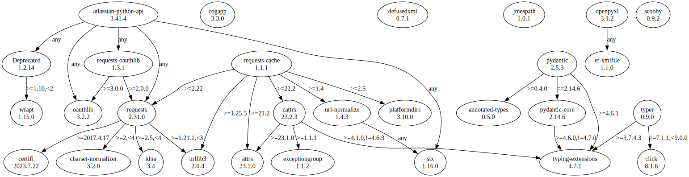

# Third Party Dependencies

<!--[[[fill sbom_sha256()]]]-->
The [SBOM in CycloneDX v1.4 JSON format](https://git.sr.ht/~sthagen/laskea/blob/default/sbom.json) with SHA256 checksum ([67936241 ...](https://git.sr.ht/~sthagen/laskea/blob/default/sbom.json.sha256 "sha256:67936241a3318fcfb38469cf857f127ff1165bab3ed7709f43598835affa9cc4")).
<!--[[[end]]] (checksum: 0b14dd995d9c4e4cc383a1e6b563ee75)-->
## Licenses 

JSON files with complete license info of: [direct dependencies](direct-dependency-licenses.json) | [all dependencies](all-dependency-licenses.json)

### Direct Dependencies

<!--[[[fill direct_dependencies_table()]]]-->
| Name                                                                          | Version                                                         | License                            | Author                                                              | Description (from packaging data)                                       |
|:------------------------------------------------------------------------------|:----------------------------------------------------------------|:-----------------------------------|:--------------------------------------------------------------------|:------------------------------------------------------------------------|
| [atlassian-python-api](https://github.com/atlassian-api/atlassian-python-api) | [3.32.2](https://pypi.org/project/atlassian-python-api/3.32.2/) | Apache Software License            | Matt Harasymczuk                                                    | Python Atlassian REST API Wrapper                                       |
| [cogapp](http://nedbatchelder.com/code/cog)                                   | [3.3.0](https://pypi.org/project/cogapp/3.3.0/)                 | MIT License                        | Ned Batchelder                                                      | Cog: A content generator for executing Python snippets in source files. |
| [defusedxml](https://github.com/tiran/defusedxml)                             | [0.7.1](https://pypi.org/project/defusedxml/0.7.1/)             | Python Software Foundation License | Christian Heimes                                                    | XML bomb protection for Python stdlib modules                           |
| [jmespath](https://github.com/jmespath/jmespath.py)                           | [1.0.1](https://pypi.org/project/jmespath/1.0.1/)               | MIT License                        | James Saryerwinnie                                                  | JSON Matching Expressions                                               |
| [openpyxl](https://openpyxl.readthedocs.io)                                   | [3.0.10](https://pypi.org/project/openpyxl/3.0.10/)             | MIT License                        | See AUTHORS                                                         | A Python library to read/write Excel 2010 xlsx/xlsm files               |
| [pydantic](https://github.com/pydantic/pydantic)                              | [1.10.4](https://pypi.org/project/pydantic/1.10.4/)             | MIT License                        | Samuel Colvin                                                       | Data validation and settings management using python type hints         |
| [requests-cache](https://github.com/requests-cache/requests-cache)            | [0.9.7](https://pypi.org/project/requests-cache/0.9.7/)         | BSD License                        | Roman Haritonov                                                     | A transparent persistent cache for the requests library                 |
| [scooby](https://github.com/banesullivan/scooby)                              | [0.7.0](https://pypi.org/project/scooby/0.7.0/)                 | MIT License                        | Dieter Werthmüller, Bane Sullivan, Alex Kaszynski, and contributors | A Great Dane turned Python environment detective                        |
| [typer](https://github.com/tiangolo/typer)                                    | [0.7.0](https://pypi.org/project/typer/0.7.0/)                  | MIT License                        | Sebastián Ramírez                                                   | Typer, build great CLIs. Easy to code. Based on Python type hints.      |
<!--[[[end]]] (checksum: 90248064c2fb033670ac591cfaf0cd2b)-->

### Indirect Dependencies

<!--[[[fill indirect_dependencies_table()]]]-->
| Name                                                                               | Version                                                     | License                              | Author                 | Description (from packaging data)                                                                       |
|:-----------------------------------------------------------------------------------|:------------------------------------------------------------|:-------------------------------------|:-----------------------|:--------------------------------------------------------------------------------------------------------|
| [Deprecated](https://github.com/tantale/deprecated)                                | [1.2.13](https://pypi.org/project/Deprecated/1.2.13/)       | MIT License                          | Laurent LAPORTE        | Python @deprecated decorator to deprecate old python classes, functions or methods.                     |
| [appdirs](http://github.com/ActiveState/appdirs)                                   | [1.4.4](https://pypi.org/project/appdirs/1.4.4/)            | MIT License                          | Trent Mick             | A small Python module for determining appropriate platform-specific dirs, e.g. a "user data dir".       |
| [attrs](https://www.attrs.org/)                                                    | [22.2.0](https://pypi.org/project/attrs/22.2.0/)            | MIT License                          | Hynek Schlawack        | Classes Without Boilerplate                                                                             |
| [cattrs](https://github.com/python-attrs/cattrs)                                   | [22.2.0](https://pypi.org/project/cattrs/22.2.0/)           | MIT License                          | Tin Tvrtkovic          | Composable complex class support for attrs and dataclasses.                                             |
| [certifi](https://github.com/certifi/python-certifi)                               | [2022.12.7](https://pypi.org/project/certifi/2022.12.7/)    | Mozilla Public License 2.0 (MPL 2.0) | Kenneth Reitz          | Python package for providing Mozilla's CA Bundle.                                                       |
| [charset-normalizer](https://github.com/ousret/charset_normalizer)                 | [2.1.1](https://pypi.org/project/charset-normalizer/2.1.1/) | MIT License                          | Ahmed TAHRI @Ousret    | The Real First Universal Charset Detector. Open, modern and actively maintained alternative to Chardet. |
| [click](https://palletsprojects.com/p/click/)                                      | [8.1.3](https://pypi.org/project/click/8.1.3/)              | BSD License                          | Armin Ronacher         | Composable command line interface toolkit                                                               |
| [et-xmlfile](https://foss.heptapod.net/openpyxl/et_xmlfile)                        | [1.1.0](https://pypi.org/project/et-xmlfile/1.1.0/)         | MIT License                          | See ATUHORS.txt        | An implementation of lxml.xmlfile for the standard library                                              |
| [exceptiongroup](https://github.com/agronholm/exceptiongroup/blob/main/README.rst) | [1.1.0](https://pypi.org/project/exceptiongroup/1.1.0/)     | MIT License                          | Alex Grönholm          | Backport of PEP 654 (exception groups)                                                                  |
| [idna](https://github.com/kjd/idna/blob/master/README.rst)                         | [3.4](https://pypi.org/project/idna/3.4/)                   | BSD License                          | Kim Davies             | Internationalized Domain Names in Applications (IDNA)                                                   |
| [oauthlib](https://github.com/oauthlib/oauthlib)                                   | [3.2.2](https://pypi.org/project/oauthlib/3.2.2/)           | BSD License                          | The OAuthlib Community | A generic, spec-compliant, thorough implementation of the OAuth request-signing logic                   |
| [requests-oauthlib](https://github.com/requests/requests-oauthlib)                 | [1.3.1](https://pypi.org/project/requests-oauthlib/1.3.1/)  | BSD License                          | Kenneth Reitz          | OAuthlib authentication support for Requests.                                                           |
| [requests](https://requests.readthedocs.io)                                        | [2.28.1](https://pypi.org/project/requests/2.28.1/)         | Apache Software License              | Kenneth Reitz          | Python HTTP for Humans.                                                                                 |
| [six](https://github.com/benjaminp/six)                                            | [1.16.0](https://pypi.org/project/six/1.16.0/)              | MIT License                          | Benjamin Peterson      | Python 2 and 3 compatibility utilities                                                                  |
| [url-normalize](https://github.com/niksite/url-normalize)                          | [1.4.3](https://pypi.org/project/url-normalize/1.4.3/)      | MIT License                          | Nikolay Panov          | URL normalization for Python                                                                            |
| [urllib3](https://urllib3.readthedocs.io/)                                         | [1.26.13](https://pypi.org/project/urllib3/1.26.13/)        | MIT License                          | Andrey Petrov          | HTTP library with thread-safe connection pooling, file post, and more.                                  |
| [wrapt](https://github.com/GrahamDumpleton/wrapt)                                  | [1.14.1](https://pypi.org/project/wrapt/1.14.1/)            | BSD License                          | Graham Dumpleton       | Module for decorators, wrappers and monkey patching.                                                    |
 <!--[[[end]]] (checksum: b58dcd233bf18af5e0dba5c772ccebfd)-->

## Dependency Tree(s)

JSON file with the complete package dependency tree info of: [the full dependency tree](package-dependency-tree.json)

### Rendered SVG

Base graphviz file in dot format: [Trees of the direct dependencies](package-dependency-tree.dot.txt)



### Console Representation

<!--[[[fill dependency_tree_console_text()]]]-->
````console
atlassian-python-api==3.32.2
  - deprecated [required: Any, installed: 1.2.13]
    - wrapt [required: >=1.10,<2, installed: 1.14.1]
  - oauthlib [required: Any, installed: 3.2.2]
  - requests [required: Any, installed: 2.28.1]
    - certifi [required: >=2017.4.17, installed: 2022.12.7]
    - charset-normalizer [required: >=2,<3, installed: 2.1.1]
    - idna [required: >=2.5,<4, installed: 3.4]
    - urllib3 [required: >=1.21.1,<1.27, installed: 1.26.13]
  - requests-oauthlib [required: Any, installed: 1.3.1]
    - oauthlib [required: >=3.0.0, installed: 3.2.2]
    - requests [required: >=2.0.0, installed: 2.28.1]
      - certifi [required: >=2017.4.17, installed: 2022.12.7]
      - charset-normalizer [required: >=2,<3, installed: 2.1.1]
      - idna [required: >=2.5,<4, installed: 3.4]
      - urllib3 [required: >=1.21.1,<1.27, installed: 1.26.13]
  - six [required: Any, installed: 1.16.0]
cogapp==3.3.0
defusedxml==0.7.1
jmespath==1.0.1
openpyxl==3.0.10
  - et-xmlfile [required: Any, installed: 1.1.0]
pydantic==1.10.4
  - typing-extensions [required: >=4.2.0, installed: 4.4.0]
requests-cache==0.9.7
  - appdirs [required: >=1.4.4, installed: 1.4.4]
  - attrs [required: >=21.2, installed: 22.2.0]
  - cattrs [required: >=22.2, installed: 22.2.0]
    - attrs [required: >=20, installed: 22.2.0]
    - exceptiongroup [required: Any, installed: 1.1.0]
  - requests [required: >=2.22, installed: 2.28.1]
    - certifi [required: >=2017.4.17, installed: 2022.12.7]
    - charset-normalizer [required: >=2,<3, installed: 2.1.1]
    - idna [required: >=2.5,<4, installed: 3.4]
    - urllib3 [required: >=1.21.1,<1.27, installed: 1.26.13]
  - url-normalize [required: >=1.4, installed: 1.4.3]
    - six [required: Any, installed: 1.16.0]
  - urllib3 [required: >=1.25.5, installed: 1.26.13]
scooby==0.7.0
typer==0.7.0
  - click [required: >=7.1.1,<9.0.0, installed: 8.1.3]
````
<!--[[[end]]] (checksum: 4f1c4bec458e35f15261fdc8350281ea)-->
