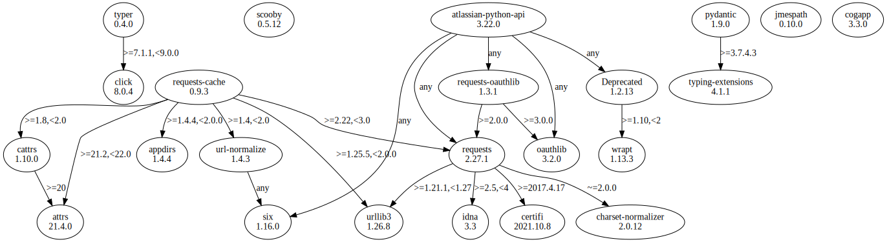

# Third Party Dependencies

The [SBOM in CycloneDX v1.4 JSON format](../sbom.json) with SHA256 checksum ([7f68ef9c2c03b2c42b52eead57092fb49f561d2d6191f054d101469cf620b466](../sbom.json.sha256)).

## Licenses 

JSON files with complete license info of: [direct dependencies](direct-dependency-licenses.json) | [all dependencies](all-dependency-licenses.json)

### Licenses of the Direct Dependencies

| Name                 | Version | License                 | Author             | URL                                                   | Description                                                             |
|----------------------|---------|-------------------------|--------------------|-------------------------------------------------------|-------------------------------------------------------------------------|
| atlassian-python-api | 3.20.1  | Apache Software License | Matt Harasymczuk   | https://github.com/atlassian-api/atlassian-python-api | Python Atlassian REST API Wrapper                                       |
| cogapp               | 3.3.0   | MIT License             | Ned Batchelder     | http://nedbatchelder.com/code/cog                     | Cog: A content generator for executing Python snippets in source files. |
| jmespath             | 0.10.0  | MIT License             | James Saryerwinnie | https://github.com/jmespath/jmespath.py               | JSON Matching Expressions                                               |
| pydantic             | 1.9.0   | MIT License             | Samuel Colvin      | https://github.com/samuelcolvin/pydantic              | Data validation and settings management using python 3.6 type hinting   |
| typer                | 0.4.0   | MIT License             | Sebastián Ramírez  | https://github.com/tiangolo/typer                     | Typer, build great CLIs. Easy to code. Based on Python type hints.      |

### Licenses of All Indirect Dependencies

| Name               | Version   | License                              | Author                 | URL                                           | Description                                                                                             |
|--------------------|-----------|--------------------------------------|------------------------|-----------------------------------------------|---------------------------------------------------------------------------------------------------------|
| Deprecated         | 1.2.13    | MIT License                          | Laurent LAPORTE        | https://github.com/tantale/deprecated         | Python @deprecated decorator to deprecate old python classes, functions or methods.                     |
| certifi            | 2021.10.8 | Mozilla Public License 2.0 (MPL 2.0) | Kenneth Reitz          | https://certifiio.readthedocs.io/en/latest/   | Python package for providing Mozilla's CA Bundle.                                                       |
| charset-normalizer | 2.0.12    | MIT License                          | Ahmed TAHRI @Ousret    | https://github.com/ousret/charset_normalizer  | The Real First Universal Charset Detector. Open, modern and actively maintained alternative to Chardet. |
| click              | 8.0.4     | BSD License                          | Armin Ronacher         | https://palletsprojects.com/p/click/          | Composable command line interface toolkit                                                               |
| idna               | 3.3       | BSD License                          | Kim Davies             | https://github.com/kjd/idna                   | Internationalized Domain Names in Applications (IDNA)                                                   |
| oauthlib           | 3.2.0     | BSD License                          | The OAuthlib Community | https://github.com/oauthlib/oauthlib          | A generic, spec-compliant, thorough implementation of the OAuth request-signing logic                   |
| requests           | 2.27.1    | Apache Software License              | Kenneth Reitz          | https://requests.readthedocs.io               | Python HTTP for Humans.                                                                                 |
| requests-oauthlib  | 1.3.1     | BSD License                          | Kenneth Reitz          | https://github.com/requests/requests-oauthlib | OAuthlib authentication support for Requests.                                                           |
| six                | 1.16.0    | MIT License                          | Benjamin Peterson      | https://github.com/benjaminp/six              | Python 2 and 3 compatibility utilities                                                                  |
| typing-extensions  | 4.1.1     | Python Software Foundation License   | UNKNOWN                | UNKNOWN                                       | Backported and Experimental Type Hints for Python 3.6+                                                  |
| urllib3            | 1.26.8    | MIT License                          | Andrey Petrov          | https://urllib3.readthedocs.io/               | HTTP library with thread-safe connection pooling, file post, and more.                                  |
| wrapt              | 1.13.3    | BSD License                          | Graham Dumpleton       | https://github.com/GrahamDumpleton/wrapt      | Module for decorators, wrappers and monkey patching.                                                    |
 
## Dependency Tree(s)

JSON file with the complete package dependency tree info of: [the full dependency tree](package-dependency-tree.json)

### Rendered SVG



### Console Representation

```console
atlassian-python-api==3.20.1
  - deprecated [required: Any, installed: 1.2.13]
    - wrapt [required: >=1.10,<2, installed: 1.13.3]
  - oauthlib [required: Any, installed: 3.2.0]
  - requests [required: Any, installed: 2.27.1]
    - certifi [required: >=2017.4.17, installed: 2021.10.8]
    - charset-normalizer [required: ~=2.0.0, installed: 2.0.12]
    - idna [required: >=2.5,<4, installed: 3.3]
    - urllib3 [required: >=1.21.1,<1.27, installed: 1.26.8]
  - requests-oauthlib [required: Any, installed: 1.3.1]
    - oauthlib [required: >=3.0.0, installed: 3.2.0]
    - requests [required: >=2.0.0, installed: 2.27.1]
      - certifi [required: >=2017.4.17, installed: 2021.10.8]
      - charset-normalizer [required: ~=2.0.0, installed: 2.0.12]
      - idna [required: >=2.5,<4, installed: 3.3]
      - urllib3 [required: >=1.21.1,<1.27, installed: 1.26.8]
  - six [required: Any, installed: 1.16.0]
cogapp==3.3.0
jmespath==0.10.0
pydantic==1.9.0
  - typing-extensions [required: >=3.7.4.3, installed: 4.1.1]
typer==0.4.0
  - click [required: >=7.1.1,<9.0.0, installed: 8.0.4]
```
